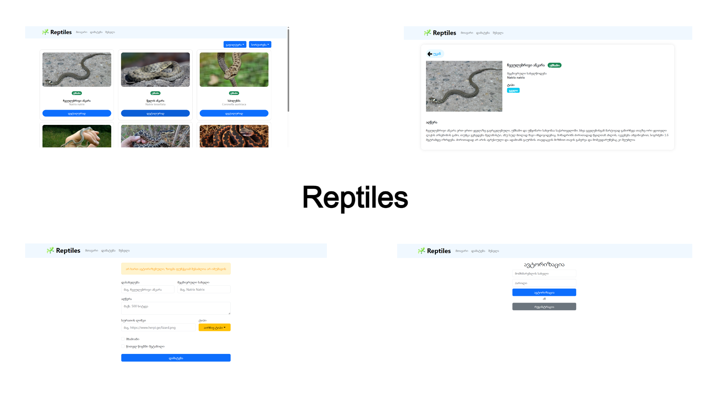

## **სკრინშოტები**

### **Reptiles is the Georgian reptile database**

React-სა და ExpressJS-ზე დაწერილი რეპტილიების მონაცემთა ბაზა

### **გამოყენებული ტექნოლოგიები**

- ReactJS
- ExpressJS
- Bootstrap
- React Router
- Redux
- Context API
- Json Server
- RegEx

### **პროექტის დასტარტვა**

პროექტი ავტომატურად დაისტარტება http://localhost:3000 -ზე, Json-Server კი 8000 პორტზე.
Json-Server-ის დასასტარტად საჭიროა ტერმინალში server ფოლდერზე გადასვლა და node index.js ბრძანების გაშვება.
სერვერის default პორტი არის 8000, პორტის შეცვლა შესაძლებელია Const ჯავასკრიპტ კლასიდან, SERVER_PORT ველის მნიშვნელობის შეცვლით. !გაითვალისწინეთ! რომ პორტის ნომერი უნდა ჩაიწეროს მხოლოდ და მხოლოდ რიცხვებში.

### **მნიშვნელოვანი**

პროექტში გამოყენებული ინფორმაციის ნაწილი და ლოგო აღებულია https://herpi.ge -დან.

### **პროექტის ავტორი**

(C) გიორგი გიგაური

### **დავმეგობრდეთ**

LinkedIn: https://www.linkedin.com/in/giorgi-gigauri-934a301a8/  
Facebook: https://www.facebook.com/giorgii.gigauri  
Instagram: https://www.instagram.com/george_gigauri  

### **სხვა ნამუშევრები**

- **Herpi** - საქართველოს რეპტილიების მონაცემთა ბაზა ([ვებსაიტი](https://herpi.ge), [აპლიკაცია](https://play.google.com/store/apps/details?id=com.gigauri.reptiledb&hl=en&gl=US))
- **BUSPLORE** - თბილისისა და რუსთავის საზოგადოებრივი ტრანსპორტის აპლიკაცია ([აპლიკაცია](https://play.google.com/store/apps/details?id=ge.transitgeorgia), [GitHub](https://github.com/george-gigauri/tbilisi-public-transport-compose-clean/tree/main))
- **Viux** - ქართული ფილმები და სერიალები (აღარ მუშაობს)
